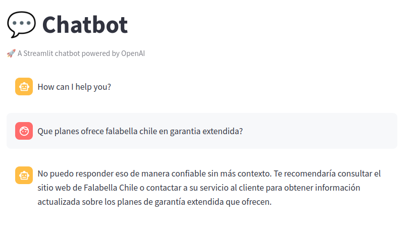
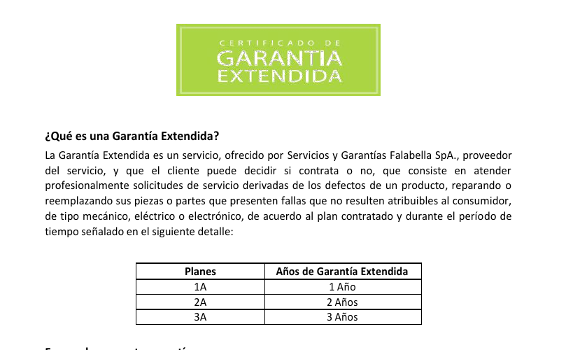
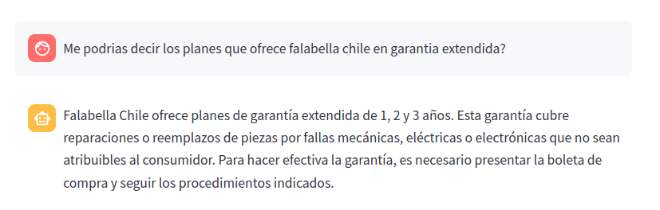
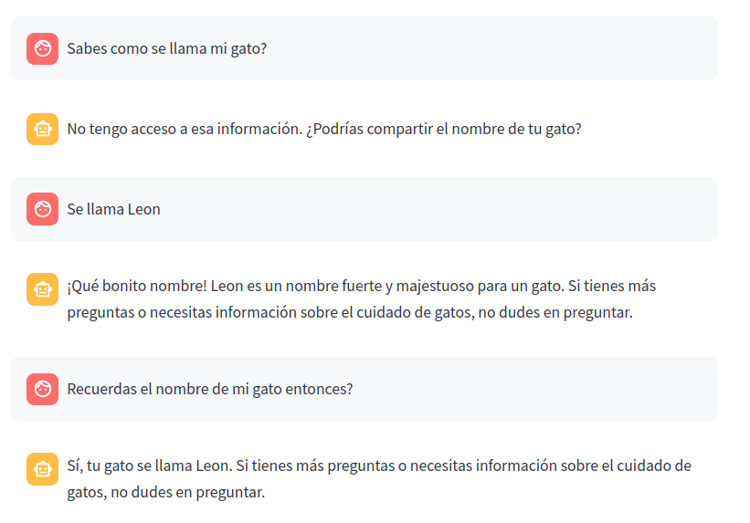

# Chatbot para análisis de PDFs 🤖📜

Este agente está pensado para analizar archivos de texto en PDF. ¡Sube tu archivo y hazle preguntas al agente!


## Cómo funciona

Se utilizan embeddings para medir la similitud semántica entre las piezas de texto del archivo, dividiéndolas en partes que servirán luego de contexto para el LLM. Las piezas de información resultantes son convertidas a embeddings para almacenarse e indexarse en la base de datos de grafos, la cual permite construir grafos de conocimiento. Se utiliza un mecanismo RAG (Retrieval Augmented Generation) para encontrar los pedazos de información más relevantes y verificar si son útiles para elaborar una respuesta. Dependiendo del criterio del LLM, se formulará una respuesta en base al contexto o, de lo contrario, con conocimiento propio. Finalmente, se verifica que la respuesta no caiga en alucinaciones.

El agente es bastante estricto en determinar qué se puede responder con el contexto dado y qué no, por lo que la pregunta debe estar bien formulada. Esto puede solucionarse facilmente con Query Transformation.

## Instalación

1. Clonar el repositorio. 
```sh
git clone https://github.com/medinanicolas/pdf_agent
cd pdf_agent
```

2. Definir las variables de ambiente. Definir la variable `OPENAI_API_KEY` dentro de `.env.example`.
Luego renombrar `env.example` a `.env.app-dev`.

3. Levantar contenedor con las tres soluciones: Base de datos Neo4j, FastAPI y Streamlit (Puede demorar un poco ☕).

```sh
docker compose -f docker-compose-dev.yml up --build
```
4. Jugar. Una vez que el proceso haya terminado, y si todo sale bien, podrás ingresar a Streamlit en `http://localhost:8501/` y empezar a probar el agente. Sube tu archivo y hazle preguntas 🤩.

## Uso

El uso del agente es sencillo.

Solo empieza con un par de preguntas y notaras que esta reacio a contestar sin mayor contexto.




Sube un archivo con el contexto necesario y vuelve a preguntar.

Yo use [este](./resources/falabella_garantia_extendida.pdf) de ejemplo.






Haz preguntas para probar la memoria del agente.




## Recursos

* [RAG Notebook](./resources/RAG.ipynb)